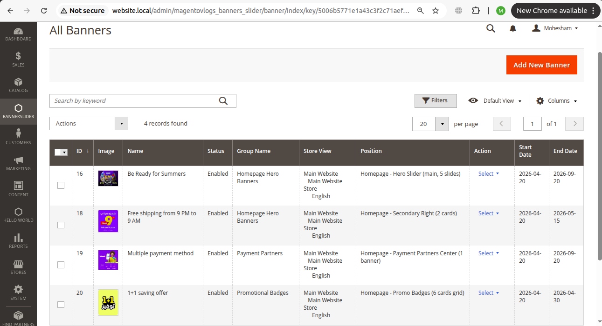
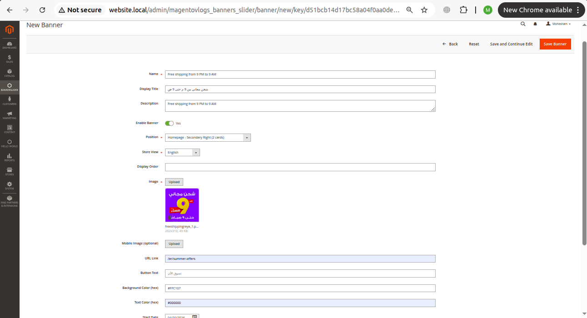
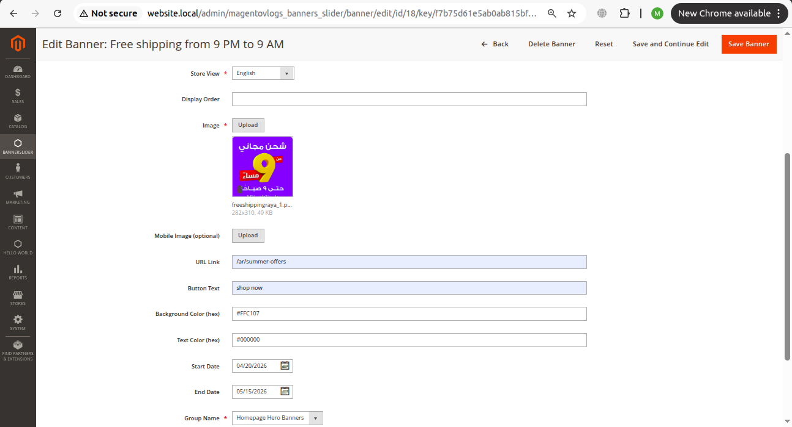
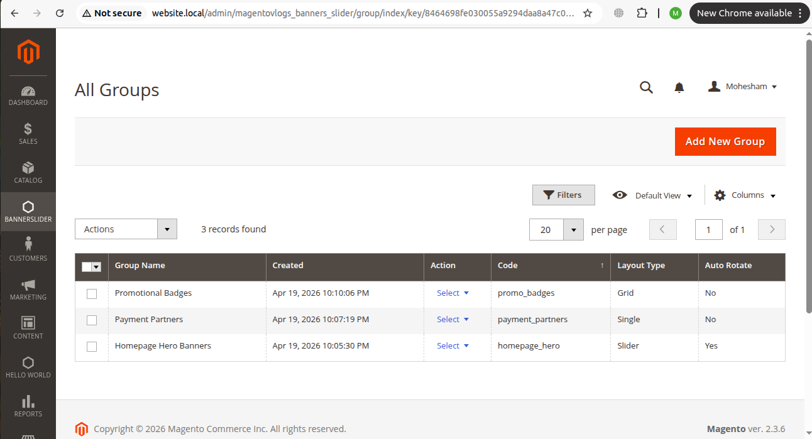
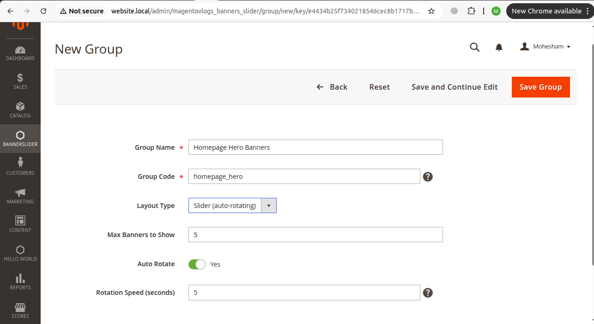
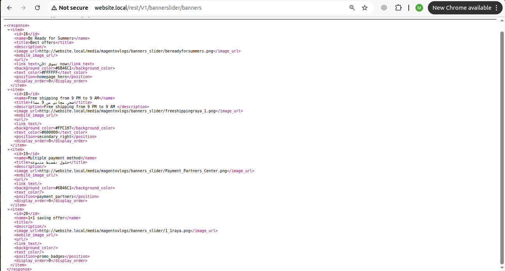
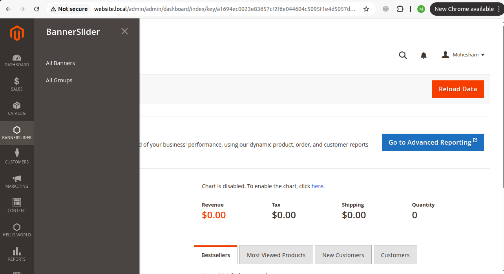

# Magento 2 Banner & Promotion Management System

A complete enterprise-level banner and promotion management module 
for Magento 2, inspired by real-world analysis of RayaShop.com — 
one of Egypt's largest eCommerce platforms.

## Screenshots

### Banner Management Grid


### Add New Banner Form  


### Edit  Banner Form  


### Group Management Grid


### Add New Group Form  


### REST API Response


### Admin Menu Location


## Features

- Complete Admin CRUD for Banners and Groups
- 15 banner positions matching RayaShop.com layout
- Desktop and Mobile image upload support
- Scheduled banners with Start/End dates
- Analytics tracking (clicks and impressions)
- REST API for headless/PWA frontends
- Arabic language support
- Multi-store support
- Inline editing in admin grids
- Mass delete functionality

## Banner Positions (Based on RayaShop.com Analysis)

This module was built after careful analysis of RayaShop.com homepage:

- Hero Slider (auto-rotating, 5 slides)
- Secondary Left/Right cards
- Payment Partners section
- Promotional Badges grid (6 cards)
- Mid-page full-width banners
- Category, Product, Cart, Checkout pages

## Group Settings

Each banner group has:
- Layout Type: Slider, Grid, or Single
- Auto Rotate: Yes/No
- Rotation Speed in seconds
- Max banners to display

## REST API Endpoints

Get all active banners:
GET /rest/V1/bannerslider/banners

Get banners by position:
GET /rest/V1/bannerslider/banners/{position}

Example:
GET /rest/V1/bannerslider/banners/homepage_hero
GET /rest/V1/bannerslider/banners/payment_partners

## Installation

```bash
cp -r MagentoVlogs/BannerSlider app/code/MagentoVlogs/BannerSlider
php bin/magento setup:upgrade
php bin/magento setup:di:compile
php bin/magento cache:clean
```

## Database Structure

Three tables:
- `magentovlogs_banners_slider_group` — Banner groups configuration
- `magentovlogs_banners_slider` — Banner records with all metadata
- `magentovlogs_banners_slider_analytics` — Click and impression tracking

## Technical Stack

- Magento 2.3+ compatible
- Declarative Schema (db_schema.xml)
- UI Components for admin grids and forms
- REST API with anonymous access
- Magento Widget system integration

## Inspired By

Built to match the promotion management needs of RayaShop.com.
The module architecture supports headless Magento implementations
where a Nuxt.js or React frontend consumes the REST API.
